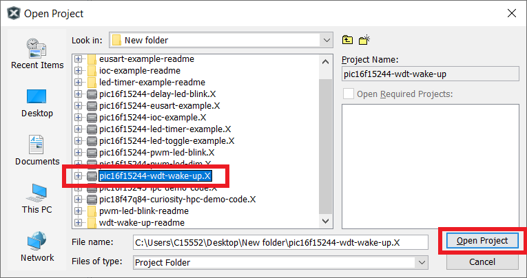
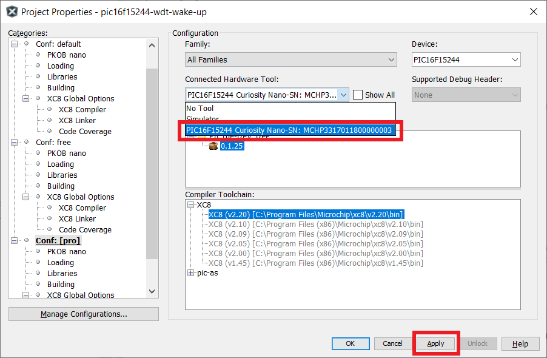
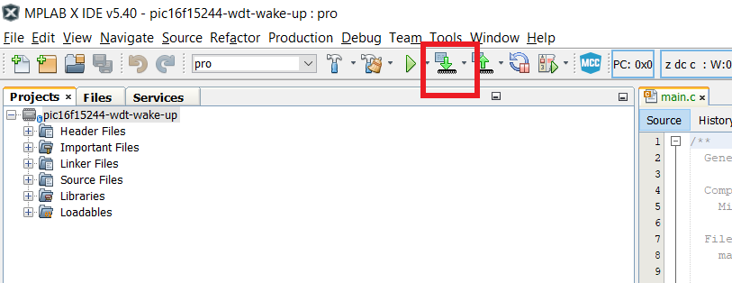
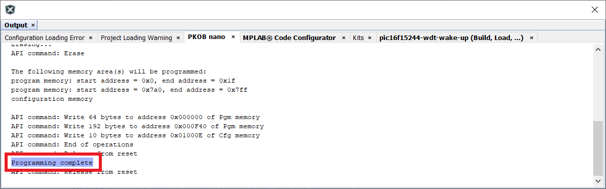
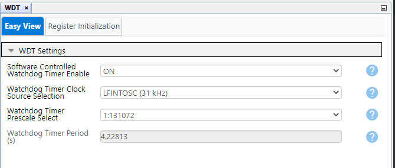

<!-- Please do not change this html logo with link -->

# Wake-up from Sleep using the Watchdog Timer with PIC16F15244

The 'pic16f15244-wdt-wake-up' code example uses the PIC16F15244 Curiosity Nano Development board to demonstrate how to use the Watchdog Timer (WDT) to wake up the microcontroller when it is in Sleep mode.

##### PIC16F15244 Curiosity Nano Development Board:

## Related Documentation
- [PIC16F15244 Product Page](https://www.microchip.com/wwwproducts/en/PIC16F15244)

## Software Used
- MPLAB® X IDE 5.45 or newer [(microchip.com/mplab/mplab-x-ide)](http://www.microchip.com/mplab/mplab-x-ide)
- MPLAB® XC8 2.31 or a newer compiler [(microchip.com/mplab/compilers)](http://www.microchip.com/mplab/compilers)
- MPLAB® Code Configurator (MCC) 4.1.0 or newer [(microchip.com/mplab/mplab-code-configurator)](https://www.microchip.com/mplab/mplab-code-configurator)
- MPLAB® Code Configurator Library 1.37.9 or newer [(microchip.com/mplab/mplab-code-configurator)](https://www.microchip.com/mplab/mplab-code-configurator)
- Microchip PIC16F1xxxx Series Device Support (1.6.143) or newer [(packs.download.microchip.com/)](https://packs.download.microchip.com/)

## Hardware Used
- PIC16F15244 Curiosity Nano [(EV09Z19A)](https://www.microchip.com/Developmenttools/ProductDetails/EV09Z19A)
- Micro-USB to USB 2.0 cable

## Setup
1. Connect the PIC16f15244 Curiosity Nano board to a PC using the Micro-USB to USB 2.0 cable.
2. If not already on your system, download and install MPLABX IDE version 5.40 (or newer).
3. If not already on your system, download and install the XC8 C-Compiler version 2.20 (or newer).
4. Open the 'pic16f15244-wdt-wake-up.X' project as shown in Figure 1.

  ###### Figure 1: Open Project Window
  

5. Press the 'Project Properites' button to open the Project Properties window. Select the Curiosity tool from the Tools drop-down menu as shown in Figure 2.

  ###### Figure 2: Select the Nano in Project Properties Window
  

6. Press the 'Make and Program Device' button to program the PIC (see Figure 3). Verify that the device was successfully programmed (see Figure 4).

  ###### Figure 3: 'Make and Program Device' Button
  

  ###### Figure 4: Program Complete
  

## Operation
After the Nano board is programmed, the Watchdog Timer is enabled, and LED0 will be in its 'ON' state. After a one second delay, the `SLEEP()` command is issued, which puts the microcontroller into its Sleep state. If the WDT reaches its maximum time period before a Clear WDT (`CLRWDT()`) command is issued, the WDT will wake up the device.

The WDT can be used to reset a program if the program stops executing code for a certain amount of time, or as a way to wake up the device after a period of time. In this example, the WDT is configured to time-out after approximately four seconds (see Figure 5). When the time-out occurs, the microcontroller wakes up, and begins to toggle LED0 every 500 ms. Example 1 shows the `main()` loop, which exectues the `SLEEP()` command, and begins to toggle LED0 after the WDT wakes up the device.

  ###### Figure 5: WDT Configuration in MCC
  

###### Example 1: Main() Code Snippet

    void main(void)
    {
        SYSTEM_Initialize();                       // Initialize the device
        CLRWDT();                                  // Clear WDT

        while (1)
        {
            LED0_SetDigitalOutput();               // Turn ON LED
            __delay_ms(1000);                      // Delay 1 second
            SLEEP();                               // Issue Sleep command

            while(1)                               // After wake-up, blink LED
            {
                LED0_SetDigitalInput();            // Turn OFF LED
                __delay_ms(500);                   // 1/2 second delay
                LED0_SetDigitalOutput();           // Turn ON LED
                __delay_ms(500);                   // 1/2 second delay
                CLRWDT();                          // Clear WDT
            }
        }
      }

## Summary
The 'pic16f15244-wdt-wake-up' code example uses the PIC16F15244 Curiosity Nano Development board to demonstrate how to use the Watchdog Timer (WDT) to wake up the microcontroller when it is in Sleep mode.
