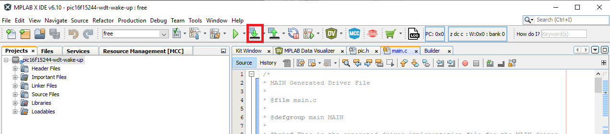
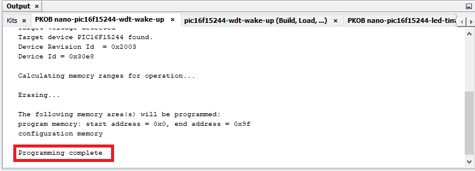

<!-- Please do not change this html logo with link -->

# Wake-up from Sleep using the Watchdog Timer with PIC16F15244

The 'pic16f15244-wdt-wake-up' code example uses the PIC16F15244 Curiosity Nano Development board to demonstrate how to use the Watchdog Timer (WDT) to wake up the microcontroller when it is in Sleep mode.

##### PIC16F15244 Curiosity Nano Development Board:

## Related Documentation
- [PIC16F15244 Product Page](https://www.microchip.com/wwwproducts/en/PIC16F15244)

## Software Used
- MPLAB® X IDE 6.10 or newer [(microchip.com/mplab/mplab-x-ide)](http://www.microchip.com/mplab/mplab-x-ide)
- MPLAB® XC8 2.41 or a newer compiler [(microchip.com/mplab/compilers)](http://www.microchip.com/mplab/compilers)
- MPLAB® Code Configurator (MCC) 5.3.7 or newer [(microchip.com/mplab/mplab-code-configurator)](https://www.microchip.com/mplab/mplab-code-configurator)
- Microchip PIC16F1xxxx Series Device Support (1.18.352) or newer [(packs.download.microchip.com/)](https://packs.download.microchip.com/)

## Hardware Used
- PIC16F15244 Curiosity Nano [(EV09Z19A)](https://www.microchip.com/Developmenttools/ProductDetails/EV09Z19A)
- Micro-USB to USB 2.0 cable

## Setup
1. Connect the PIC16F15244 Curiosity Nano board to a PC using the Micro-USB to USB 2.0 cable.
2. If the system not ready, download and install MPLABX IDE version 6.10 (or newer).
3. If the system not ready, download and install the XC8 C-Compiler version 2.41 (or newer).
4. Open the 'pic16f15244-wdt-wake-up.X' project as shown in Figure 1.

  ###### Figure 1: Open Project Window
  

5. Click-> **Project Properties** button to open the Project Properties window. Select the Curiosity tool from the Tools drop-down menu as shown in Figure 2.

  ###### Figure 2: Select the Nano in Project Properties Window
  

6. Click-> **Make and Program Device** button to program the PIC (see Figure 3). Verify that the device was successfully programmed (see Figure 4).

  ###### Figure 3: 'Make and Program Device' Button
  

  ###### Figure 4: Program Complete
  

## Operation
After the Nano board is programmed, the Watchdog Timer is enabled, and LED0 will be in its 'ON' state. After a one second delay, the `SLEEP()` command is issued, which puts the microcontroller into its Sleep state. If the WDT reaches its maximum time period before a Clear WDT (`CLRWDT()`) command is issued, the WDT will wake up the device.

The WDT can be used to reset a program, if the program stops executing code for a certain amount of time, or as a way to wake up the device after a period of time. In this example, the WDT is configured to time-out after approximately four seconds (see Figure 5). When the time-out occurs, the microcontroller wakes up, and begins to toggle LED0 every 500 ms. Example 1 shows the `main()` loop, which executes the `SLEEP()` command, and begins to toggle LED0 after the WDT wakes up the device.

  ###### Figure 5: WDT Configuration in MCC
  

###### Example 1: Main() Code Snippet

    int main(void)
    {
      SYSTEM_Initialize();

      CLRWDT();           // Clear WDT

      LED0_SetLow();      // Turn ON LED
      __delay_ms(1000);   //Delay 1 Second
      SLEEP();            //Issue Sleep Command

      while(1)
      {
          LED0_Toggle();    //Toggle LED
          __delay_ms(500);  // Delay 500 Milli Second
          CLRWDT();         // Clear WDT
      }
      }

## Summary
The 'pic16f15244-wdt-wake-up' code example uses the PIC16F15244 Curiosity Nano Development board to demonstrate how to use the Watchdog Timer (WDT) to wake up the microcontroller when it is in Sleep mode.
